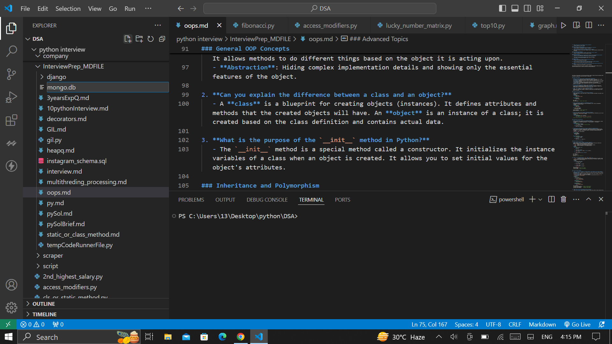

https://www.turing.com/kb/python-multiprocessing-vs-multithreading

**Multiprocessing and multithreading** are two approaches for achieving concurrency in Python, but they have different characteristics and use cases. Here's a detailed comparison:

### Multithreading

**Definition:**
- Multithreading involves running multiple threads (smaller units of a process) concurrently within the same process.

**Advantages:**
1. **Lightweight:** Threads are lighter and use less memory compared to processes.
2. **Shared Memory:** Threads within the same process share the same memory space, which makes it easier to share data between threads without the need for inter-process communication (IPC).
3. **Faster Context Switching:** Switching between threads is generally faster than switching between processes because threads share the same memory space.

**Disadvantages:**
1. **Global Interpreter Lock (GIL):** Python's GIL allows only one thread to execute Python bytecode at a time per process, which means true parallelism is not achieved for CPU-bound tasks.
2. **Complex Debugging:** Multithreaded programs can be harder to debug due to race conditions and deadlocks.

**Use Cases:**
- Suitable for I/O-bound tasks, such as web scraping, network operations, and file I/O, where threads can spend a lot of time waiting for I/O operations to complete.

**Example:**
```python
import threading

def print_numbers():
    for i in range(10):
        print(i)

thread = threading.Thread(target=print_numbers)
thread.start()
thread.join()
```

### Multiprocessing

**Definition:**
- Multiprocessing involves running multiple processes concurrently, with each process having its own memory space.

**Advantages:**
1. **True Parallelism:** Multiprocessing bypasses the GIL, allowing multiple processes to run in parallel on multiple CPU cores, making it suitable for CPU-bound tasks.
2. **Isolation:** Processes are isolated from each other, reducing the risk of memory corruption and making debugging easier.

**Disadvantages:**
1. **Memory Overhead:** Each process has its own memory space, which can lead to higher memory usage compared to multithreading.
2. **Inter-process Communication (IPC):** Sharing data between processes requires IPC mechanisms like pipes, queues, or shared memory, which can add complexity and overhead.

**Use Cases:**
- Suitable for CPU-bound tasks, such as data processing, computation-intensive operations, and parallel execution of algorithms.

**Example:**
```python
import multiprocessing

def print_numbers():
    for i in range(10):
        print(i)

process = multiprocessing.Process(target=print_numbers)
process.start()
process.join()
```

### Summary

| Feature                      | Multithreading                                            | Multiprocessing                                            |
|------------------------------|-----------------------------------------------------------|------------------------------------------------------------|
| Execution                    | Multiple threads within a single process                  | Multiple processes                                         |
| Memory Sharing               | Shared memory space                                       | Separate memory space                                      |
| Concurrency Level            | Limited by GIL for CPU-bound tasks                        | True parallelism                                           |
| Best Suited for              | I/O-bound tasks                                           | CPU-bound tasks                                            |
| Memory Overhead              | Lower                                                     | Higher                                                     |
| Communication                | Easier (shared memory)                                    | More complex (IPC mechanisms)                              |
| Debugging                    | More complex (race conditions, deadlocks)                 | Easier (process isolation)                                 |
| Example Use Case             | Web scraping, network operations, file I/O                | Data processing, computationally intensive tasks           |

By understanding these differences, you can choose the appropriate approach for your concurrent programming needs in Python.





Yes, Python supports multithreading, but it's important to understand the nuances of how multithreading works in Python.

### Multithreading in Python
- Python provides a built-in `threading` module to support multithreading. This allows you to run multiple threads (smaller units of a process) concurrently.

### The Global Interpreter Lock (GIL)
- **GIL**: Python has a Global Interpreter Lock (GIL), which is a mutex that protects access to Python objects, preventing multiple native threads from executing Python bytecodes at once. This means that even if you have multiple threads, only one thread executes Python code at a time per process.
  
  - **Impact**: Due to the GIL, Python threads are not able to fully leverage multiple CPU cores for CPU-bound tasks. However, they can be quite useful for I/O-bound tasks, such as handling file I/O, network requests, or waiting for user input, where the program spends a lot of time waiting for external operations.

### When to Use Python Multithreading
- **I/O-bound tasks**: Multithreading is particularly useful in I/O-bound tasks where the program spends a significant amount of time waiting for resources that are external to the CPU (e.g., disk I/O, network operations). For example, downloading files, web scraping, and database querying.
  
- **CPU-bound tasks**: For CPU-bound tasks, Python's multithreading may not offer a performance improvement due to the GIL. In such cases, alternatives like multiprocessing (which creates separate processes that bypass the GIL) might be more effective.

### Example of Python Multithreading
```python
import threading
import time

def print_numbers():
    for i in range(5):
        print(f"Number: {i}")
        time.sleep(1)

def print_letters():
    for letter in ['a', 'b', 'c', 'd', 'e']:
        print(f"Letter: {letter}")
        time.sleep(1)

# Create threads
t1 = threading.Thread(target=print_numbers)
t2 = threading.Thread(target=print_letters)

# Start threads
t1.start()
t2.start()

# Wait for both threads to complete
t1.join()
t2.join()

print("Both threads finished.")
```

### Alternative to Multithreading: Multiprocessing
- For CPU-bound tasks, consider using the `multiprocessing` module in Python, which creates separate processes (instead of threads). Each process has its own Python interpreter and memory space, allowing you to bypass the GIL and utilize multiple CPU cores effectively.

### Conclusion
- **Multithreading** is supported in Python and is useful for I/O-bound tasks, but its performance can be limited for CPU-bound tasks due to the GIL.
- For CPU-bound tasks that need parallelism, consider using the `multiprocessing` module instead.


The Global Interpreter Lock (GIL) in Python can be a limitation, particularly for CPU-bound tasks that need to run in parallel. However, there are several strategies you can use to work around the GIL, depending on the specific problem you're trying to solve.

### 1. **Use the `multiprocessing` Module**
The most common way to bypass the GIL is to use the `multiprocessing` module instead of the `threading` module. While threads share the same memory space, processes have their own separate memory space, so they are not bound by the GIL.

- **Example: Using Multiprocessing for Parallel Execution**
```python
import multiprocessing

def compute_square(n):
    return n * n

if __name__ == "__main__":
    numbers = [1, 2, 3, 4, 5]
    with multiprocessing.Pool(processes=4) as pool:
        results = pool.map(compute_square, numbers)
    print(results)
```
In this example, the `multiprocessing.Pool` is used to distribute the computation of the square of numbers across multiple processes, thereby bypassing the GIL.

### 2. **Use C Extensions or `ctypes`/`cffi`**
Another way to work around the GIL is to offload CPU-bound tasks to native code (C/C++), which does not require the GIL to be released. This can be done using:

- **C extensions:** Write performance-critical parts of your code in C or C++ and use them in Python.
- **`ctypes`/`cffi`:** Use these libraries to call C functions directly from Python.

For example, the `numpy` library, which is heavily used in scientific computing, does much of its work in native code, and as a result, it can perform many operations without being slowed down by the GIL.

### 3. **Use `cython`**
`Cython` is a superset of Python that allows you to write C extensions for Python in a simpler syntax. With `Cython`, you can declare types for variables, which allows Cython to generate C code that can run much faster than regular Python code.

- **Releasing the GIL in Cython**
You can explicitly tell `Cython` to release the GIL when running certain parts of your code:
```cython
from cython.parallel import prange

def compute_sum(int n):
    cdef int i
    cdef double total = 0
    for i in prange(n, nogil=True):
        total += i
    return total
```
The `nogil=True` keyword allows the loop to run without holding the GIL, enabling true parallelism on multiple cores.

### 4. **Use Alternative Python Implementations**
Some Python implementations do not have a GIL, or they manage concurrency differently:

- **Jython:** A Python implementation that runs on the Java platform. It uses Java threads and does not have a GIL.
- **IronPython:** A Python implementation that runs on the .NET framework, also without a GIL.
- **PyPy (STM):** PyPy has experimental support for Software Transactional Memory (STM), which aims to eliminate the GIL.

### 5. **Utilize Concurrent Distributed Systems**
For large-scale applications, you might consider distributing tasks across multiple machines, using tools like:

- **Apache Spark:** A distributed computing framework that can run Python code across many machines.
- **Dask:** A parallel computing library in Python that scales to larger-than-memory datasets and can parallelize computations.

### 6. **Optimize Algorithmic Design**
Finally, sometimes the best way to work around the GIL is to rethink your algorithm. For example:

- **Reduce the number of threads:** If possible, minimize the use of threads for CPU-bound tasks.
- **Batch processing:** Group tasks together to reduce the overhead of starting and stopping threads or processes.

### Summary
- **Multiprocessing** is the go-to solution for bypassing the GIL in CPU-bound tasks.
- **C extensions**, `cython`, or alternative Python implementations can also help in specific cases.
- For large-scale applications, consider distributed computing or rethink your algorithmic approach.

By leveraging these techniques, you can effectively minimize or eliminate the impact of the GIL on your Python applications.


It seems like you're asking about concurrency and parallelism. Here’s a brief explanation of both concepts:

### Concurrency
- **Definition**: Concurrency is the ability of a system to manage multiple tasks at the same time. It involves breaking down a task into smaller sub-tasks that can be executed in overlapping time periods.
- **Key Point**: Tasks may not necessarily run simultaneously; they may be interleaved, allowing for efficient use of resources.

### Parallelism
- **Definition**: Parallelism is a specific type of concurrency where multiple tasks are executed simultaneously, usually on multiple processors or cores.
- **Key Point**: It requires hardware that supports simultaneous execution, making it suitable for tasks that can be divided into smaller, independent subtasks.

### Summary
- **Concurrency** is about dealing with many things at once (but not necessarily doing them at the same time).
- **Parallelism** is about doing many things at the same time.

If you need more details or examples, feel free to ask!